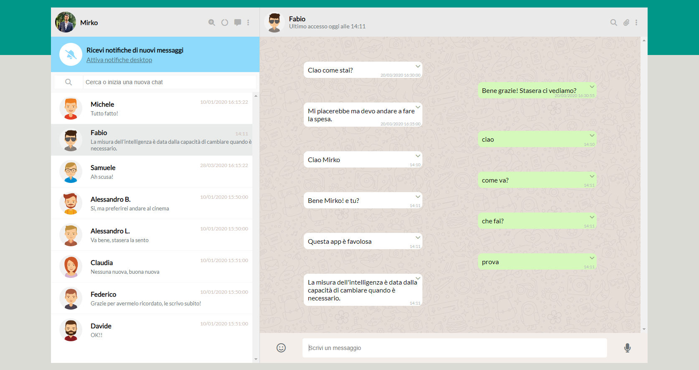
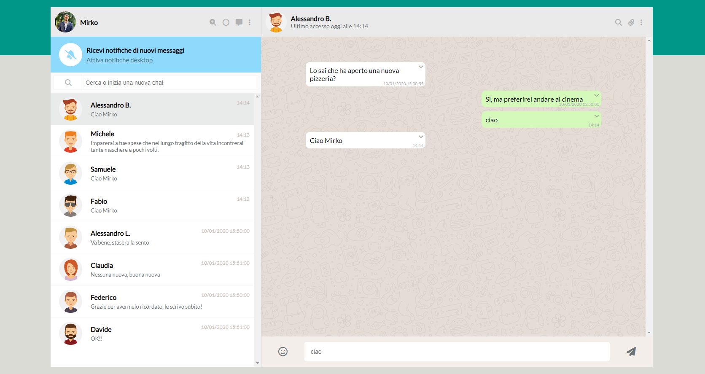
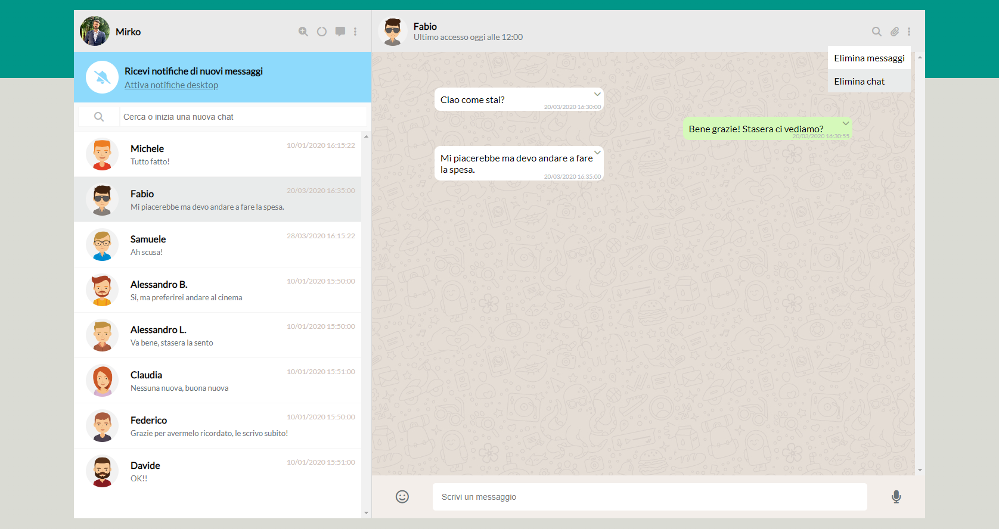
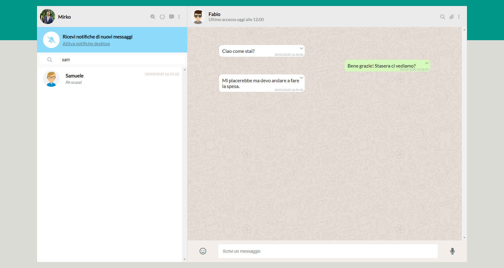
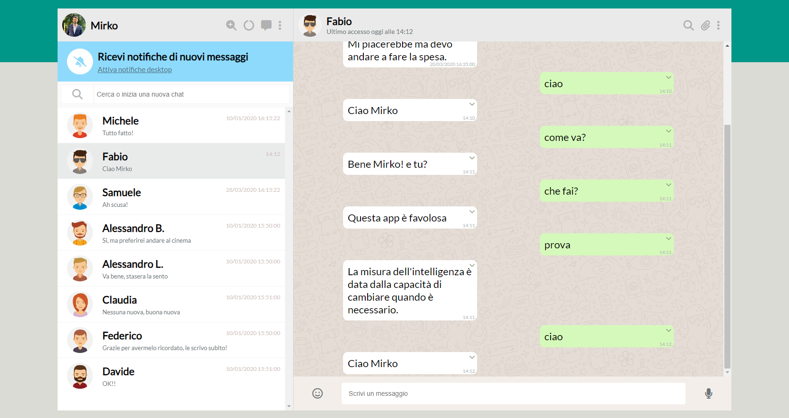

# Boolzapp

Esercizio "Boolzapp"

## 🔗 Contatti

## 🛠 Skills

HTML, CSS, JS, VueJS...

## Boolzapp Pagina iniziale

## Boolzapp Chat

## Boolzapp Chat in ordine di orario dell'ultimo messaggio

## Boolzapp Cancella messaggio

## Boolzapp Elimina Chat

## Boolzapp Opzione di ricerca contatto

## Boolzapp Zoom Pagina

